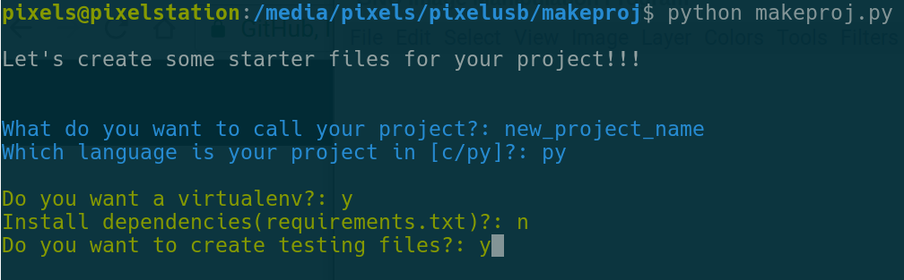

# makeproj

Python CLI script that takes user input and bootstrap new projects.


Languages supported:
	* Python
	* C

```Shell
$ python3 makeproj.py --help

Let's create some starter files for your project!!!


Usage: makeproj.py [OPTIONS]

Options:
  -n, --name TEXT             Name of your project
  -l, --lang [c|py]           Which language is your project in[c/python]?
  -o, --output_dir DIRECTORY
  --help                      Show this message and exit.
```
## Dependencies
* Python==3.6
* click==6.7
* colorama==0.3.9
* Jinja2==2.10
* MarkupSafe==1.0

## How to install?

1. Git clone repo [https://github.com/JacobPolloreno/makeproj](https://github.com/JacobPolloreno/makeproj)
2. `cd makeproj`
3. `pip install -r requirements.txt`
4. `python3 makeproj.py --help`

### Example Usage


## What's included?

### C
- Makefile
- gitignore
- Add your libft [my library](https://github.com/JacobPolloreno/42AIML)
- README.md
- main.c

### Python
- Virtualenv
- Install dependencies
- Test files and install pyTest
- gitignore

### What if I want to modify the generated code?

Templates files can be found under `/templates/<LANG>` and are written in jinja2 format. You can modify them to your liking.

You can also include more files but you'll need to modify the makeproj.py script.